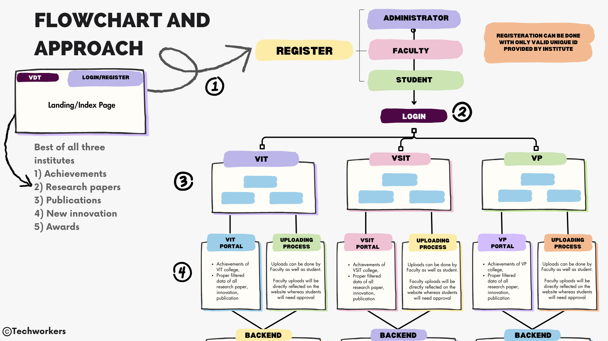

# Innovation Excellence Portal — 

*A unified portal to track, measure, and showcase innovation across institutes (VIT, VSIT, VP). Built with Core PHP & MySQL.*

## 🚀 Overview

A secure, role-based web portal for administrators, faculty, and students to:

* Upload and manage **Achievements, Research Papers, Publications, Innovations, and Awards**
* Visualize KPIs via **dynamic dashboards** (charts/graphs)
* Import data from files/APIs and support **manual entry + approval flows**
* Collaborate through feedback, recognition, and comments
* Ensure **privacy, access control, and multilingual support**

> 

---
<p align="center">
  <a href="https://github.com/FarhanSayed16/College-Innovation-Portal/stargazers"></a>
  <a href="https://github.com/FarhanSayed16/College-Innovation-Portal/network/members"></a>
  
  
  
  
</p>

---
## ✨ Key Features

* **Role-based Access**

  * **Admin:** institute setup, user management, bulk imports, approvals, analytics
  * **Faculty:** direct publish (auto-approved), manage department records, review student submissions
  * **Student:** submit entries (needs approval), view analytics, receive badges/recognition
* **Modules**

  * Achievements | Research Papers | Publications | New Innovations | Awards
* **Dashboards & KPIs**

  * Trends, totals, department splits, top contributors, time series
* **Data Ingestion**

  * CSV/XLSX import, basic API hooks, manual forms with validation
* **Collaboration**

  * Comments, feedback loops, badges/spotlight sections
* **Compliance**

  * Authentication, audit logs, record-level permissions, GDPR-style data handling
* **Multilingual**

  * Language toggle + content i18n (labels/messages)

---

## 🛠️ Tech Stack

* **Frontend:** HTML5, CSS3, Bootstrap, vanilla JS (Chart.js for graphs)
* **Backend:** Core PHP (procedural/structured), PHP sessions, basic MVC-ish organization
* **Database:** MySQL (InnoDB, FK constraints)
* **Other:** PHPMailer (email notifications), PHPSpreadsheet (imports)

---

## 🗂️ Suggested Folder Structure

```
College-Innovation-Portal/
│── add\_indicator.php       # Add innovation indicators
│── admin\_panel.php         # Admin dashboard
│── admin\_students.php      # Manage student users
│── admin\_view\.php          # Admin view of submissions
│── chart.php               # Graphs & charts (innovation stats)
│── config.php              # Configuration file
│── dashboard.php           # Main dashboard (post login)
│── db.php                  # Database connection
│── delete\_file.php         # Delete uploaded files
│── faculty\_page.php        # Faculty dashboard
│── faculty1.php            # Alternate faculty view
│── file\_path/              # File storage (uploads)
│── index.php               # Landing / Login/Register
│── index\_style.css         # Styles for landing page
│── login.php               # Login logic
│── login.css               # Login page styling
│── logout.php              # Logout script
│── register.php            # Registration page
│── student\_page.php        # Student dashboard
│── student\_upload.php      # Student upload form
│── style.css               # Global styling
│── upload\_file.php         # Upload UI
│── upload\_handler.php      # Upload handling script
│── README.md               # Documentation
│── Research paper on AI.pdf # Sample uploaded document

```

---

## 🛠️ Tech Stack
- **Frontend:** HTML, CSS (custom + index/login styles), basic JS
- **Backend:** Core PHP (procedural)
- **Database:** MySQL
- **Visualization:** PHP + Chart.js for graphs
  
```

## 🧱 Minimal DB Schema (core tables)

```sql
-- Users & Roles
CREATE TABLE roles (
  id INT PRIMARY KEY AUTO_INCREMENT,
  name VARCHAR(20) UNIQUE NOT NULL -- admin, faculty, student
);

CREATE TABLE users (
  id INT PRIMARY KEY AUTO_INCREMENT,
  institute ENUM('VIT','VSIT','VP') NOT NULL,
  role_id INT NOT NULL,
  name VARCHAR(120) NOT NULL,
  email VARCHAR(120) UNIQUE NOT NULL,
  password_hash VARCHAR(255) NOT NULL,
  language VARCHAR(10) DEFAULT 'en',
  UNIQUE KEY (email),
  FOREIGN KEY (role_id) REFERENCES roles(id)
);

-- Unified records table (type-driven)
CREATE TABLE records (
  id INT PRIMARY KEY AUTO_INCREMENT,
  type ENUM('achievement','paper','publication','innovation','award') NOT NULL,
  title VARCHAR(255) NOT NULL,
  description TEXT,
  author_id INT NOT NULL,           -- submitter
  owner_role ENUM('student','faculty') NOT NULL,
  department VARCHAR(120),
  tags VARCHAR(255),
  file_path VARCHAR(255),
  year YEAR,
  status ENUM('pending','approved','rejected') DEFAULT 'pending',
  created_at TIMESTAMP DEFAULT CURRENT_TIMESTAMP,
  updated_at TIMESTAMP DEFAULT CURRENT_TIMESTAMP ON UPDATE CURRENT_TIMESTAMP,
  FOREIGN KEY (author_id) REFERENCES users(id)
);

-- Comments / feedback
CREATE TABLE comments (
  id INT PRIMARY KEY AUTO_INCREMENT,
  record_id INT NOT NULL,
  user_id INT NOT NULL,
  content TEXT NOT NULL,
  created_at TIMESTAMP DEFAULT CURRENT_TIMESTAMP,
  FOREIGN KEY (record_id) REFERENCES records(id),
  FOREIGN KEY (user_id) REFERENCES users(id)
);

-- Audit log
CREATE TABLE audit_logs (
  id INT PRIMARY KEY AUTO_INCREMENT,
  user_id INT,
  action VARCHAR(120),
  entity VARCHAR(60),
  entity_id INT,
  created_at TIMESTAMP DEFAULT CURRENT_TIMESTAMP
);
```

---

## 🔐 Security & Privacy

* Session-based auth, password hashing (bcrypt), CSRF tokens on forms
* Input sanitization & prepared statements (PDO)
* Per-record authorization (student needs approval, faculty auto-publish)
* Audit logging for sensitive actions
* PII minimization and data export/delete on request

---

## 📊 Dashboards (examples)

* **Totals by type** (cards)
* **Yearly trends** (line)
* **Department breakdown** (bar)
* **Top contributors** (table)
* **Institute comparison** (stacked bar)

---

## 🧩 Import Flow

1. Admin/Faculty uploads CSV/XLSX (mapped columns: title, type, department, year, tags…)
2. Preview → Validate → Commit
3. Conflicts/duplicates → queued for review

---

## 🌍 Multilingual

* `lang/en.php`, `lang/hi.php`, `lang/mr.php` (labels/messages)
* Language toggle stored in user profile/session

---

## 🧪 Setup & Run

```bash
# 1) Clone into your web root (e.g., htdocs or public_html)
git clone <repo> innovation-portal
cd innovation-portal

# 2) Create .env or /app/config/db.php
# Example /app/config/db.php (PDO)
<?php
return [
  'dsn' => 'mysql:host=localhost;dbname=innovation_portal;charset=utf8mb4',
  'user' => 'root',
  'pass' => '',
];

# 3) Import /database/schema.sql in MySQL
# 4) Configure virtual host or access via http://localhost/innovation-portal/public
```

---

## 🧭 Workflow (matches your flowchart)

1. **Register/Login** using institute-issued unique ID (Admin | Faculty | Student)
2. **Select Institute** (VIT/VSIT/VP) → landing dashboard
3. **Upload/Manage** entries (faculty auto-publish; student → approval queue)
4. **View & Share** dynamic dashboards and highlights across institutes

---

## 🛣️ Roadmap

* Advanced search & filters, saved reports
* Role-based email notifications & digests
* API-first endpoints for external systems
* Fine-grained approval (multi-stage) & SLAs
* SSO (Google/Microsoft), 2FA
* File virus scanning on upload
* More languages & RTL support

---

## 🙌 Credits

Built at **Vidyalankar School of Information Technology** by **Farhan Sayed** (Core PHP + MySQL).

---
